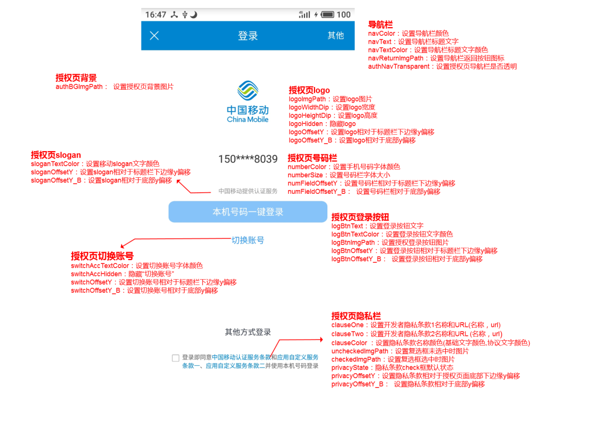
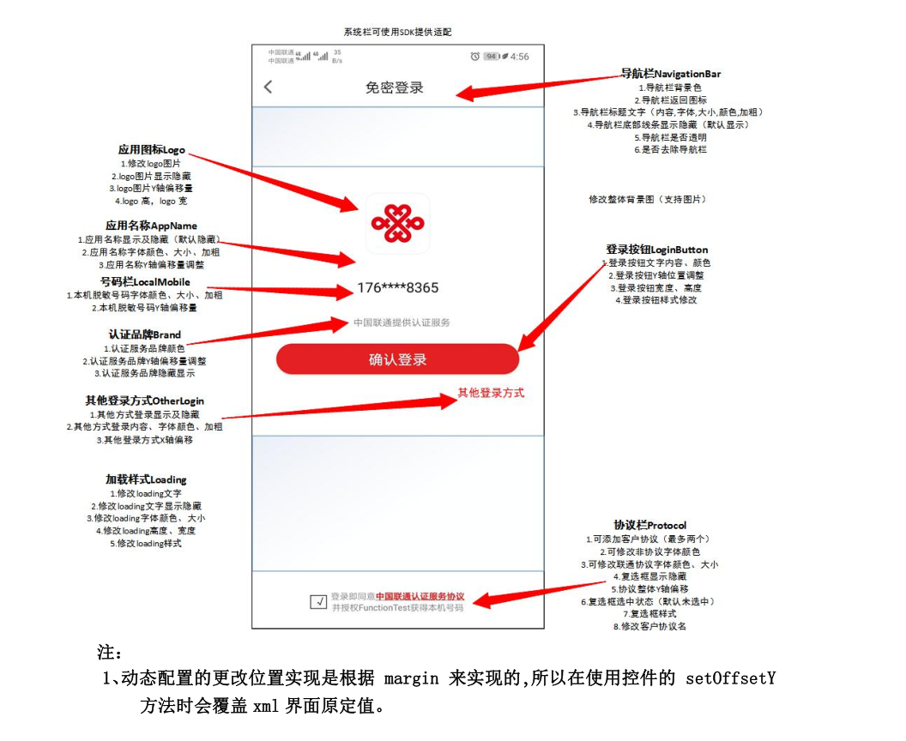

### SDK说明
一键登录SDK提供移动，电信以及联通的一键登录及本机校验功能
### SDK集成
#### 1、添加aar包依赖
将从官网下载下来的一键登录aar包放到项目的libs目录下，然后在模块的build.gradle中的dependencies添加相关依赖

示例：

```
dependencies {
    implementation(name: 'quicklogin-external-release', ext: 'aar') // aar包具体名称请以官网下载下来为准
    implementation(name: 'CMCCSSOSDK-release', ext: 'aar')
    implementation(name: 'Ui-factory_oauth_mobile_3.8.3', ext: 'aar')
    implementation(name: 'CTAccount_sdk_api_v3.7.0_all', ext: 'aar')
    implementation 'com.google.code.gson:gson:2.8.5'    // 配置对gson的依赖
    implementation 'com.squareup.okhttp3:okhttp:3.3.1'  // 配置对okhttp的依赖
}
```
然后在app的build.gradle的android下添加

```
 repositories {
        flatDir {
            dirs 'libs'
        }
    }
```

### SDK接口
#### QuickLogin
本机校验和一键登录功能的提供类，主要提供获取单例，预取号，本机校验/一键登录，设置预取url等接口
##### 1 获取QuickLogin单例

```
QuickLogin login = QuickLogin.getInstance(getApplicationContext(), BUSINESS_ID);// BUSINESS_ID为从易盾官网申请的业务id
```

##### 2 预取号（一键登录前请务必先调用该接口获取手机掩码）

```
login.prefetchMobileNumber(new QuickLoginPreMobileListener() {
        @Override
        public void onGetMobileNumberSuccess(String YDToken, final String mobileNumber) {
         // 注:对于联通和移动而言，因必须使用运营商界面，因此无需关心mobileNumber，对于移动和联通而言该值会返回null，直接在该回调中调用取号接口onePass即可
        }

        @Override
        public void onGetMobileNumberError(String YDToken, final String msg) {
        
        }
    });
```
**NOITE**:对于移动和联通而言因必须使用运营商界面，onGetMobileNumberSuccess回调中mobileNumber形参值为null，无需关心该值内容，直接在该回调中调用取号接口onePass即可展示一键登录界面并自动显示掩码mobileNumber

##### 3 一键登录

**NOITE**:调用一键登录接口前请务必调用预取号接口，在预取号接口的成功回调中调用一键登录接口，获取运营商授权码与易盾token  
API定义：

```
 /**
 * 一键登录功能，使用该接口前需要先调用fetchPreviewMobileNumber接口进行预取号
 *
 * @param listener 回调监听器
 */
public void onePass(final QuickLoginTokenListener listener)
```
使用示例

```
login.onePass(new QuickLoginTokenListener() {
    @Override
    public void onGetTokenSuccess(final String YDToken, final String accessCode) {
        Log.d(TAG, String.format("yd token is:%s accessCode is:%s", YDToken, accessCode));
        tokenValidate(YDToken, accessCode, true);
    }

    @Override
    public void onGetTokenError(String YDToken, String msg) {
        Log.d(TAG, "获取运营商授权码失败:" + msg);
    }
});

```

##### 4 本机校验
API定义：
```
public void getToken(final String mobileNumber, final QuickLoginTokenListener listener)
```
第一个参数表示用户输入的进行本机校验的手机号码，第二个参数是获取token的回调监听器    
使用示例：

```
  login.getToken(mobileNumber, new QuickLoginTokenListener() {
            @Override
            public void onGetTokenSuccess(final String YDToken, final String accessCode) {
                runOnUiThread(new Runnable() {
                    @Override
                    public void run() {
                        Log.d(TAG, "获取Token成功" + YDToken + accessCode);
                        tokenValidate(YDToken, accessCode, false);
                    }
                });
            }

            @Override
            public void onGetTokenError(final String YDToken, final String msg) {
                runOnUiThread(new Runnable() {
                    @Override
                    public void run() {
                        Toast.makeText(getApplicationContext(), "获取Token失败" + YDToken + msg, Toast.LENGTH_LONG).show();
                    }
                });

            }
        });
```
##### 5判断运营商类型

```
public static QuickLogin.OperatorType getOperatorType(Context context) // 获取运营商类型
返回值为枚举OperatorType，具体含义如下
 enum OperatorType {
        TYPE_CM(0, "移动"),
        TYPE_CU(1, "联通"),
        TYPE_CT(2, "电信"),
        TYPE_WIFI(3, "wifi"),
        TYPE_UNKNOWN(4, "未知");
        OperatorType(int type, String tip) {
        }
    }
```
##### 6 其他接口

```
public void setPreCheckUrl(String url) // 设置预取url接口
public void setExtendData(JSONObject extendData) // 设置扩展数据
public boolean onExtendMsg(JSONObject extendMsg) // 当用户自定义预取Url后，如果在自己业务后端判断调用非法，可直接调用该接口返回false实现快速降级，以及获取自己业务后端处理后返回的数据
public void setCULoginUiConfig(CULoginUiConfig cuLoginUiConfig) // 设置联通一键登录页面自定义属性，详细可配置信息{@link CULoginUiConfig}
public void setCMLoginUiConfig(CMLoginUiConfig cmLoginUiConfig) // 设置移动一键登录页面自定义属性，详细可配置信息{@link CMLoginUiConfig}
```


#### QuickLoginPreMobileListener
预取号的回调监听器，接入者需要实现该接口的如下2个抽象方法

```
public abstract class QuickLoginPreMobileListener implements QuickLoginListener {
     /**
     * @param YDToken      易盾Token
     * @param mobileNumber 获取的手机号码掩码
     */
    void onGetMobileNumberSuccess(String YDToken, String mobileNumber);

    /**
     * @param YDToken 易盾Token
     * @param msg     获取手机号掩码失败原因
     */
    void onGetMobileNumberError(String YDToken, String msg);
    
     /**
     * 业务方自定义PreCheck后，业务方扩展字段的回调，
     * 返回false表示业务方希望中断sdk后续流程处理，直接降级
     *
     * @param extendMsg
     * @return 返回true表示继续后续处理，返回false表示业务方希望降级终止后续处理，默认返回true
     */
     boolean onExtendMsg(JSONObject extendMsg);
}
```
#### QuickLoginTokenListener
一键登录或本机校验的获取运营商accessToken的回调监听器，接入者需要实现该接口的如下2个抽象方法

```
public abstract class QuickLoginTokenListener implements QuickLoginListener {
   /**
     * @param YDToken    易盾token
     * @param accessCode 运营商accessCode
     */
    void onGetTokenSuccess(String YDToken, String accessCode);

    /**
     * @param YDToken 易盾token
     * @param msg     出错提示信息
     */
    void onGetTokenError(String YDToken, String msg);
    
     /**
     * 业务方自定义PreCheck后，业务方扩展字段的回调，
     * 返回false表示业务方希望中断sdk后续流程处理，直接降级
     *
     * @param extendMsg
     * @return 返回true表示继续后续处理，返回false表示业务方希望降级终止后续处理，默认返回true
     */
    boolean onExtendMsg(JSONObject extendMsg);
}
```

### 使用步骤
#### 1创建QuickLogin对象实例

```
QuickLogin login = QuickLogin.getInstance(getApplicationContext(),
```

#### 2根据本机校验或一键登录需求调用对应的接口
##### 2.1 一键登录
###### 2.1.1 调用prefetchMobileNumber接口预取号

```
login.prefetchMobileNumber(new QuickLoginPreMobileListener() {
        @Override
        public void onGetMobileNumberSuccess(String YDToken, final String mobileNumber) {
        // 在该成功回调中能够获取到此次请求的易盾token以及预取号获取的手机掩码
        }

        @Override
        public void onGetMobileNumberError(String YDToken, final String msg) {
        //  在该错误回调中能够获取到此次请求的易盾token以及预取号获取手机掩码失败的原因
        }
        @Override
        public boolean onExtendMsg(JSONObject extendMsg) {
           Log.d(TAG, "获取的扩展字段内容为:" + extendMsg.toString());
           // 如果接入者自定义了preCheck接口，可在该方法中通过返回true或false来进行控制是否快速降级
           return super.onExtendMsg(extendMsg);
        }
    });
```
###### 2.1.2 调用onePass一键登录

```
login.onePass(new QuickLoginTokenListener() {
    @Override
    public void onGetTokenSuccess(final String YDToken, final String accessCode) {
        Log.d(TAG, String.format("yd token is:%s accessCode is:%s", YDToken, accessCode));
        // 在一键登录获取token的成功回调中使用易盾token和运营商token去做token的验证，具体验证规则请参看服务端给出的说明文档
        tokenValidate(YDToken, accessCode, true);
    }

    @Override
    public void onGetTokenError(String YDToken, String msg) {
        Log.d(TAG, "获取运营商token失败:" + msg);
        // 一键登录获取token失败的回调
    }
});
```
##### 2.2 本机校验
###### 调用getToken接口进行本机校验

```
// 本机校验获取token
login.getToken(mobileNumber, new QuickLoginTokenListener() {
    @Override
    public void onGetTokenSuccess(final String YDToken, final String accessCode) {
        runOnUiThread(new Runnable() {
            @Override
            public void run() {
                Toast.makeText(getApplicationContext(), "获取Token成功" + YDToken + accessCode, Toast.LENGTH_LONG).show();
                Log.d(TAG, "获取Token成功" + YDToken + accessCode);
                tokenValidate(YDToken, accessCode, false);
            }
        });

    }

    @Override
    public void onGetTokenError(final String YDToken, final String msg) {
        runOnUiThread(new Runnable() {
            @Override
            public void run() {
                Toast.makeText(getApplicationContext(), "获取Token失败" + YDToken + msg, Toast.LENGTH_LONG).show();
            }
        });

    }
    @Override
    public boolean onExtendMsg(JSONObject extendMsg) {
        Log.d(TAG, "获取的扩展字段内容为:" + extendMsg.toString());
        // 如果接入者自定义了preCheck接口，可在该方法中通过返回true或false来进行控制是否快速降级
        return super.onExtendMsg(extendMsg);
    }
});
```
##### 2.3 使用自定义PreCheck接口与扩展字段功能
如果接入者需要接管preCheck过程做自己的一些业务逻辑，可以使用如下方式
```
login.setPreCheckUrl(customUrl); // 使用自定义url代理preCheck接口
JSONObject extData = new JSONObject();
        try {
            extData.put("parameter1", "param1");
            extData.put("parameter2", "param2");
        } catch (JSONException e) {
            e.printStackTrace();
        }
login.setExtendData(extData); // 如果自定义url需要接受一些自己的业务参数，通过该接口进行设置
```
### 自定义登录界面属性
对于联通和移动而言，因为必须使用运营商的登录界面，为此我们提供了一些开放接口用来让您可以在运营商界面的基础上进行相关UI元素的调整与配置。

#### 1. 移动授权页页面细则与相关自定义接口

- 授权页面细则

  

- 自定义属性接口：CMLoginUiConfig

  ```
      /**
       * 设置导航栏属性
       *
       * @param backgroundColor： 导航栏背景色
       * @param text：            导航栏标题文本
       * @param textColor：       导航栏标题文字颜色
       * @param backIconPath：    导航栏返回按钮图标
       * @param isTransparent：   导航栏是否透明
       * @return
       */
      public CMLoginUiConfig setNavigationBar(int backgroundColor, String text, int textColor, String backIconPath, boolean isTransparent)
       
      /**
       * 设置授权页背景
       *
       * @param backgroundImagePath： 授权页背景图片路径
       * @return
       */
      public CMLoginUiConfig setBackgroundImagePath(String backgroundImagePath)
       
  
      /**
       * 设置Logo属性
       *
       * @param logoImagePath： logo图片路径
       * @param width：         logo宽度
       * @param height：        logo高度
       * @param isHidden:      是否隐藏logo
       * @param yOffsetTop：    logo相对于标题栏下边缘y轴偏移（单位：dp）
       * @param yOffsetBottom： logo相对于底部y偏移
       * @return
       */
      public CMLoginUiConfig setLogo(String logoImagePath, int width, int height, boolean isHidden, int yOffsetTop, int yOffsetBottom)
  
      /**
       * 设置手机掩码属性
       *
       * @param maskNumberColor： 手机掩码字体颜色
       * @param maskNumberSize：  手机掩码字体大小
       * @param yOffsetTop：      掩码栏相对于标题栏下边缘y轴偏移
       * @param yOffsetBottom：   号码栏相对于底部y轴偏移
       * @return
       */
      public CMLoginUiConfig setMobileMaskNumber(int maskNumberColor, int maskNumberSize, int yOffsetTop, int yOffsetBottom) 
  
      /**
       * 设置授权页Slogan属性
       *
       * @param textColor：     slogan文字颜色
       * @param yOffsetTop：    slogan相对于标题栏下边缘y偏移
       * @param yOffsetBottom： slogan相对于底部y偏移
       * @return
       */
      public CMLoginUiConfig setSlogan(int textColor, int yOffsetTop, int yOffsetBottom)
      /**
       * 设置登录按钮属性
       *
       * @param text：                登录按钮文字
       * @param textColor：           登录按钮文字颜色
       * @param backgroundImagePath： 登录按钮背景图片路径
       * @param yOffsetTop：          登录按钮相对于标题栏下边缘y偏移
       * @param yOffsetBottom：       登录按钮相对于底部y偏移
       * @return
       */
      public CMLoginUiConfig setLoginButton(int width, int height, String text, int textColor,
                                            String backgroundImagePath, int yOffsetTop, int yOffsetBottom)
  
      /**
       * 设置切换账号相关属性
       *
       * @param textColor：     切换账号字体颜色
       * @param isHidden：      是否隐藏“切换账号”
       * @param yOffsetTop：    切换账号相对于标题栏下边缘y偏移
       * @param yOffsetBottom： 切换账号相对于底部y偏移
       * @return
       */
      public CMLoginUiConfig setSwitchAccount(int textColor, boolean isHidden, int yOffsetTop, int yOffsetBottom) 
      /**
       * 设置自定义View属性
       *
       * @param customView：      自定义View
       * @param viewId：          自定义View的layout布局id
       * @param viewPosition：    自定义View放置在登录界面的位置，值包含以下2类
       *                         1） RootViewId.ROOT_VIEW_ID_TITLE_BAR，标题栏
       *                         2）RootViewId.ROOT_VIEW_ID_BODY，授权页空白处
       * @param customInterface： 自定义View点击事件响应回调
       * @return
       */
      public CMLoginUiConfig setCustomView(View customView, String viewId, int viewPosition, CustomInterface customInterface)
  
      /**
       * 设置底部隐私栏条款属性
       *
       * @param textColor：                隐私栏文字颜色
       * @param protocolColor：            隐私栏协议颜色
       * @param protocolCheckImagePath：   复选框选中时图片路径
       * @param protocolUnCheckImagePath： 复选框未选中时图片路径
       * @param yOffsetTop：               隐私条款相对于标题栏下边缘y偏移
       * @param yOffsetBottom：            隐私条款相对于底部y偏移
       * @return
       */
      public CMLoginUiConfig setClause(int textColor, int protocolColor, String protocolCheckImagePath,String protocolUnCheckImagePath, int yOffsetTop, int yOffsetBottom)
  
      /**
       * 设置底部隐私栏条款属性
       * 已过时，推荐使用 {@link #setClause(int, int, int, boolean, String, String, int, int, int, int, boolean)}
       * 与{@link #setClauseText(String, String, String, String, String, String)}代替
       *
       * @param clause：                   开发者隐私条款1名称
       * @param url：                      开发者隐私条款1的Url
       * @param clause2：                  开发者隐私条款2名称
       * @param clause2Url：               开发者隐私条款2的Url
       * @param textColor：                隐私栏文字颜色
       * @param protocolColor：            隐私栏协议颜色
       * @param protocolCheckImagePath：   复选框选中时图片路径
       * @param protocolUnCheckImagePath： 复选框未选中时图片路径
       * @param yOffsetTop：               隐私条款相对于标题栏下边缘y偏移
       * @param yOffsetBottom：            隐私条款相对于底部y偏移
       * @param isDefaultChecked：         隐私协议框是否默认勾选
       * @return
       */
      @Deprecated
      public CMLoginUiConfig setClause(String clause, String url, String clause2, String clause2Url,
                                       int textColor, int protocolColor, String protocolCheckImagePath,
                                       String protocolUnCheckImagePath, int yOffsetTop, int yOffsetBottom, boolean isDefaultChecked)
  
      /**
       * 设置底部隐私栏条款属性
       *
       * @param textSize                 条款字体大小
       * @param baseColor                条款文案中非隐私协议部分的颜色
       * @param protocolColor            条款文案中隐私协议的颜色
       * @param isGravityCenter          条款是否居中
       * @param protocolCheckImagePath   复选框选中时图片路径
       * @param protocolUnCheckImagePath 复选框未选中时图片路径
       * @param checkBoxWidth            复选框宽度
       * @param checkBoxHeight           复选框高度
       * @param yOffsetTop               隐私条款相对于标题栏下边缘y偏移
       * @param yOffsetBottom            隐私条款相对于底部y偏移
       * @param isDefaultChecked         隐私协议框是否默认勾选
       * @return
       */
      public CMLoginUiConfig setClause(int textSize, int baseColor, int protocolColor, boolean isGravityCenter,
                                       String protocolCheckImagePath, String protocolUnCheckImagePath, int checkBoxWidth, int checkBoxHeight,
                                       int yOffsetTop, int yOffsetBottom, boolean isDefaultChecked) 
      /**
       * 设置隐私条款文案
       *
       * @param clauseStart 条款开始部分文案，例如“登录即同意”
       * @param clause      条款一名称
       * @param url         条款一对应的url
       * @param clause2     条款二名称
       * @param clause2Url  条款二对应的url
       * @param clauseEnd   条款结束文案，例如“并授权使用本机号码登录”
       * @return
       */
      public CMLoginUiConfig setClauseText(String clauseStart, String clause, String url, String clause2, String clause2Url, String clauseEnd)
      
      /**
       * 设置认证主题配置
       * 如果希望更细化的控制一些配置项，可使用AuthThemeConfig.Builder()的形式来创建主题配置对象，
       * 然后调用该接口设置主题对象，示例如下：
       * <p>
       * {@code
       * AuthThemeConfig config = new AuthThemeConfig.Builder()
       * .setAuthNavTransparent(false)
       * .setNavColor(0xff0086d0)
       * .build();
       * CMLoginUiConfig cmLoginUiConfig = new CMLoginUiConfig().setAuthThemeConfig(config);
       * }
       * </p>
       *
       * @param authThemeConfig
       */
      public CMLoginUiConfig setAuthThemeConfig(AuthThemeConfig authThemeConfig)
  ```
  
- 自定义选项示例：

  ```
  RelativeLayout.LayoutParams layoutParams = new RelativeLayout.LayoutParams(RelativeLayout.LayoutParams.WRAP_CONTENT, RelativeLayout.LayoutParams.WRAP_CONTENT);
          layoutParams.addRule(RelativeLayout.CENTER_HORIZONTAL, RelativeLayout.TRUE);
          layoutParams.setMargins(0, dip2px(this, 450), 0, 0);
          View otherLoginView = LayoutInflater.from(getApplicationContext()).inflate(R.layout.layout_custom_view, null, false);
          otherLoginView.setLayoutParams(layoutParams);
          CMLoginUiConfig cmLoginUiConfig = new CMLoginUiConfig()
                  // 设置导航栏属性
                  .setNavigationBar(Color.RED, "登录/注册", Color.WHITE, "back", false)
                  // 设置Logo属性
                  .setLogo("ico_logo", 100, 100, false, 100, 0)
                  // 设置预取号掩码属性
                  .setMobileMaskNumber(Color.BLACK, 20, 170, 0)
                  // 设置Slogan属性
                  .setSlogan(Color.BLACK, 200, 0)
                  // 设置登录按钮属性
                  .setLoginButton("一键登录/注册", Color.WHITE, null, 380, 0)
                  // 设置动态添加自定义View属性
                  .setCustomView(otherLoginView, "R.layout.layout_custom_view", AuthRegisterViewConfig.RootViewId.ROOT_VIEW_ID_BODY, new CustomInterface() {
                      @Override
                      public void onClick(Context context) {
                          Toast.makeText(context, "点击了动态注册的View", Toast.LENGTH_SHORT).show();
                      }
                  })
                  // 设置隐私条款属性
                  .setClause("自定义条款协议名称1", "https://www.baidu.com", "自定义条款协议名称2", "https://www.baidu.com",
                          Color.BLACK, Color.RED, "checkbox_true", "checkbox_false", 0, 10);
          login.setCMLoginUiConfig(cmLoginUiConfig);
  ```

  更细化的自定义选项示例：

  ```
   // 更细化的控制,单独设置每一项
   AuthThemeConfig config = new AuthThemeConfig.Builder()
   .setAuthNavTransparent(false)
   .setNavColor(Color.RED)
   .setXXX // 省略其他设置项
   .setPrivacyState(true) // 设置默认勾选协议框
   .build();
   CMLoginUiConfig cmLoginUiConfig2 = new CMLoginUiConfig().setAuthThemeConfig(config);
   login.setCMLoginUiConfig(cmLoginUiConfig2);
  ```
  
  注：更细化的控制接口和自定义属性接口不能混用

#### 2. 联通授权页页面细则与相关自定义接口

- 授权页面细则

  

- 自定义属性接口：CULoginUiConfig

```
      /**
      * 设置导航栏配置
      *
      * @param backgroundColor：           导航栏背景色
      * @param backButtonBackgroundResId： 返回按钮背景资源
      * @param textSize：                  导航栏标题字体大小
      * @param textColor：                 导航栏标题颜色
      * @param isBold：                    导航栏标题是否使用粗体
      * @param isShowLine：                是否显示导航栏底部线条
      * @return
      */
  ​   public CULoginUiConfig setNavigationBar(int backgroundColor, int backButtonBackgroundResId, int textSize,int textColor, boolean isBold, boolean isShowLine) 

      /**
       * 设置导航栏配置
       *
       * @param backgroundColor：      导航栏背景色
       * @param backButtonBackground： 返回按钮背景
       * @param textSize：             导航栏标题字体大小
       * @param textColor：            导航栏标题颜色
       * @param isBold：               导航栏标题是否使用粗体
       * @param isShowLine：           是否显示导航栏底部线条
       * @param systemBarTransparent： 系统状态栏是否透明
       * @param isFullScreen：         是否全屏，即铺满系统状态栏
       * @return
       */
      public CULoginUiConfig setNavigationBar(int backgroundColor, int backButtonBackground,
                                              int textSize, int textColor, boolean isBold,
                                              boolean isShowLine, boolean systemBarTransparent,                                               boolean isFullScreen) 
                                              
      /**
       * 设置登录界面的Logo属性
       *
       * @param resId：   logo图片的资源ID
       * @param width：   logo宽度
       * @param height：  logo高度
       * @param isShow：  logo是否显示
       * @param offsetY： logo图片Y轴偏移量（相对上一个控件而言）
       * @return
       */
      public CULoginUiConfig setLogo(int resId, int width, int height, boolean isShow, int                                          offsetY) 
      
      /**
       * 设置应用名称属性
       *
       * @param isShow：    是否显示，默认隐藏
       * @param textColor： 应用名称字体颜色
       * @param offsetY：   应用名称Y轴偏移量
       * @return
       */
      public CULoginUiConfig setAppName(boolean isShow, int textColor, int offsetY)
      
      /**
       * 设置应用名称属性
       *
       * @param isShow：    是否显示，默认隐藏
       * @param textColor： 应用名称字体颜色
       * @param offsetY：   应用名称Y轴偏移量
       * @param textSize：  应用名称字体大小
       * @param isBold：    是否加粗
       * @return
       */
      public CULoginUiConfig setAppName(boolean isShow, int textColor, int offsetY, int textSize, boolean isBold)
      
      /**
       * 设置登录界面的背景
       *
       * @param resId
       * @return
       */
      public CULoginUiConfig setBackground(int resId)
      
      /**
       * 设置登录按钮属性
       *
       * @param width：   登录按钮宽度
       * @param height：  登录按钮高度
       * @param offsetY： 登录按钮Y轴偏移调整量
       * @return
       */
      public CULoginUiConfig setLoginButton(int width, int height, int offsetY)
      
      /**
       * 设置登录按钮属性
       *
       * @param width：   登录按钮宽度
       * @param height：  登录按钮高度
       * @param offsetY： 登录按钮Y轴偏移调整量
       * @param text：    登录按钮文本内容
       * @return
       */
      public CULoginUiConfig setLoginButton(int width, int height, int offsetY, String text)
      
      /**
       * 设置登录按钮属性
       *
       * @param width：              登录按钮宽度
       * @param height：             登录按钮高度
       * @param offsetY：            登录按钮Y轴偏移调整量
       * @param text：               登录按钮文本内容
       * @param protocolCheckRes：   协议选中时登录按钮状态的资源Id
       * @param protocolUnCheckRes： 协议未选中时登录按钮状态的资源Id
       * @return
       */
      public CULoginUiConfig setLoginButton(int width, int height, int offsetY, String text,
                                            int protocolCheckRes, int protocolUnCheckRes)
      
      /**
       * 设置本机脱敏号码属性
       *
       * @param textColor： 本机脱敏号码字体颜色
       * @param offsetY：   本机脱敏号码Y轴偏移量
       * @return
       */
      public CULoginUiConfig setMobileMaskNumber(int textColor, int offsetY)
      
      /**
       * 设置本机脱敏号码属性
       *
       * @param textColor： 本机脱敏号码字体颜色
       * @param textSize：  本机脱敏号码字体大小
       * @param offsetY：   本机脱敏号码Y轴偏移量
       * @return
       */
      public CULoginUiConfig setMobileMaskNumber(int textColor, int textSize, int offsetY)
      
      /**
       * 设置本机脱敏号码属性
       *
       * @param textColor： 本机脱敏号码字体颜色
       * @param textSize：  本机脱敏号码字体大小
       * @param offsetY：   本机脱敏号码Y轴偏移量
       * @param bold：      本机脱敏号码是否加粗
       * @return
       */
      public CULoginUiConfig setMobileMaskNumber(int textColor, int textSize, int offsetY,                                                      boolean bold)
      
      /**
       * 设置认证服务品牌属性，即《中国联通服务提供认证》文案的相关属性
       *
       * @param color：   认证服务品牌颜色
       * @param offsetY： 认证服务品牌Y轴偏移量
       * @param isShow：  认证服务品牌是否显示，默认显示
       * @return
       */
      public CULoginUiConfig setBrand(int color, int offsetY, boolean isShow
      
      /**
       * 设置其他登录方式属性
       *
       * @param text：   其他登录方式内容
       * @param color：  其他登录方式字体颜色
       * @param bold：   其他登录方式文案是否加粗
       * @param isShow： 其他登录方式是否显示
       * @return
       */
      public CULoginUiConfig setOtherLogin(String text, int color, boolean bold, boolean isShow) 
      
      /**
       * 设置其他登录方式属性
       *
       * @param text：    其他登录方式内容
       * @param color：   其他登录方式字体颜色
       * @param bold：    其他登录方式文案是否加粗
       * @param isShow：  其他登录方式是否显示
       * @param offsetX： 其他登录方式X轴偏移
       * @return
       */
      public CULoginUiConfig setOtherLogin(String text, int color, boolean bold, boolean isShow,                                          int offsetX)
      
      /**
       * 设置登录界面是否显示Loading框
       *
       * @param isShowLoading
       * @return
       */
      public CULoginUiConfig setShowLoading(boolean isShowLoading)
      
      /**
       * 设置登录界面Loading框的提示文案
       *
       * @param loadingTip
       * @return
       */
      public CULoginUiConfig setLoadingTip(String loadingTip)
      
      /**
       * 设置登录界面Loading属性
       *
       * @param loadingTip： loading提示
       * @param width：      loading宽度
       * @param height：     loading高度
       * @param textSize：   loading字体大小
       * @param textColor：  loading字体颜色
       * @return
       */
      public CULoginUiConfig setLoading(String loadingTip, int width, int height, int textSize,                                         int textColor)
      
      /**
       * 设置登录界面Loading属性
       *
       * @param loadingTip： loading提示
       * @param width：      loading宽度
       * @param height：     loading高度
       * @param textSize：   loading字体大小
       * @param textColor：  loading字体颜色
       * @param isShow：     loading文案是否显示
       * @return
       */
      public CULoginUiConfig setLoading(String loadingTip, int width, int height, int textSize,                                         int textColor, boolean isShow)
      
      /**
       * 设置登录界面Loading属性
       *
       * @param loadingTip：         loading提示
       * @param width：              loading宽度
       * @param height：             loading高度
       * @param textSize：           loading字体大小
       * @param textColor：          loading字体颜色
       * @param isShow：             loading文案是否显示
       * @param backgroundResource： loading背景样式资源Id
       * @return
       */
      public CULoginUiConfig setLoading(String loadingTip, int width, int height, int textSize,
                                        int textColor, boolean isShow, int backgroundResource)
      
      /**
       * 设置协议属性
       * 要完成该操作需要在aar包中将布局文件复制粘贴至接入方项目，在xml中添加控件后，
       * 将添加的控件ID及需要跳转的url通过该接口进行设置方可点击
       *
       * @param offsetY：       协议整体的Y轴偏移
       * @param textColor：     联通协议字体颜色
       * @param textSize：      联通协议字体大小
       * @param protocolId：    接入者自定义协议控件ID
       * @param protocolText：  协议1文案
       * @param protocolLink：  接入者自定义协议跳转链接
       * @param protocol2Id：   接入者自定义协议2控件ID
       * @param protocol2Text： 协议2文案
       * @param protocol2Link： 接入者自定义协议2跳转链接
       * @return
       */
      public CULoginUiConfig setProtocol(int offsetY, int textColor, int textSize,
                                     String protocolId, String protocolText, String protocolLink,
                                     String protocol2Id, String protocol2Text, String                                                protocol2Link)
      
      /**
       * 设置协议属性
       * 要完成该操作需要在aar包中将布局文件复制粘贴至接入方项目，在xml中添加控件后，
       * 将添加的控件ID及需要跳转的url通过该接口进行设置方可点击
       *
       * @param offsetY：       协议整体的Y轴偏移
       * @param textColor：     联通协议字体颜色
       * @param textSize：      联通协议字体大小
       * @param checkBoxStyle： 复选框选中样式
       * @param protocolId：    接入者在xml自定义协议控件ID
       * @param protocolText：  协议1文案
       * @param protocolLink：  接入者自定义协议跳转链接
       * @param protocol2Id：   接入者在xml自定义协议2控件ID
       * @param protocol2Text： 协议2文案
       * @param protocol2Link： 接入者自定义协议2跳转链接
       * @return
       */
      public CULoginUiConfig setProtocol(int offsetY, int textColor, int textSize, int                               checkBoxStyle,String protocolId, String protocolText, String protocolLink,
                       String protocol2Id, String protocol2Text, String protocol2Link)
      /**
       * 设置View显示或隐藏
       *
       * @param viewNames        待设置隐藏属性的控件名称数组，可设置名称 {@link com.sdk.mobile.manager.login.cucc.ConstantCucc}
       * @param visibilityValues 控件是否隐藏的bool值，与{@code viewNames}的每一项一一对应
       * @return
       */
      public CULoginUiConfig setViewsVisibility(String[] viewNames, boolean[] visibilityValues)
      
      /**
       * 设置View背景资源文件
       *
       * @param viewNames 待设置背景资源的控件名称数组，可设置名称 {@link com.sdk.mobile.manager.login.cucc.ConstantCucc}
       * @param resIds    控件对应的具体资源Id，与{@code viewNames}的每一项一一对应
       * @return
       */
      public CULoginUiConfig setViewsBackgroundResource(String[] viewNames, int[] resIds)
      
      /**
       * 设置控件相对于Y轴偏移
       *
       * @param viewNames    待设置偏移属性的控件名称数组，可设置名称 {@link com.sdk.mobile.manager.login.cucc.ConstantCucc}
       * @param offsetValues 控件一一对应的具体偏移值，与{@code viewNames}的每一项一一对应
       * @return
       */
      public CULoginUiConfig setViewsOffsetY(String[] viewNames, int[] offsetValues)
      
       /**
       * 设置控件字体是否粗体
       *
       * @param viewNames  待设置粗体属性的控件名称数组，可设置名称 {@link com.sdk.mobile.manager.login.cucc.ConstantCucc}
       * @param boldValues 控件是否使用粗体的bool值，与{@code viewNames}的每一项一一对应
       * @return
       */
      public CULoginUiConfig setViewsBold(String[] viewNames, boolean[] boldValues) 
      
       /**
       * 设置控件字体内容
       *
       * @param viewNames 待修改字体内容的控件名称数组，可设置名称 {@link com.sdk.mobile.manager.login.cucc.ConstantCucc}
       * @param texts     控件对应修改的内容，与{@code viewNames}的每一项一一对应
       * @return
       */
      public CULoginUiConfig setViewsText(String[] viewNames, String[] texts)
      
      /**
       * 设置控件字体颜色
       *
       * @param viewNames  待修改字体颜色的控件名称数组，可设置名称 {@link com.sdk.mobile.manager.login.cucc.ConstantCucc}
       * @param textColors 控件对应的颜色值，与{@code viewNames}的每一项一一对应
       * @return
       */
      public CULoginUiConfig setViewsTextColor(String[] viewNames, int[] textColors) 
      
      /**
       * 设置控件字体大小
       *
       * @param viewNames 待修改字体大小的控件名称数组，可设置名称 {@link com.sdk.mobile.manager.login.cucc.ConstantCucc}
       * @param textSizes 控件字体大小对应的具体值，与{@code viewNames}的每一项一一对应
       * @return
       */
      public CULoginUiConfig setViewsTextSize(String[] viewNames, int[] textSizes)
      
      /**
       * 设置是否显示协议复选框
       *
       * @param isShowProtocolBox
       * @return
       */
      public CULoginUiConfig setShowProtocolBox(boolean isShowProtocolBox)
      
      /**
       * 设置其它登录按钮的点击事件监听
       *
       * @param customViewListener： 事件监听器
       * @return
       */
      public CULoginUiConfig setOtherLoginListener(OnCustomViewListener customViewListener)
      
      /**
       * 设置自定义控件区的事件监听
       *
       * @param customViewId：       在xml中放置的自定义控件的ID
       * @param customViewListener： 事件监听器
       * @return
       */
      public CULoginUiConfig setCustomViewListener(String customViewId, OnCustomViewListener                                                      customViewListener)
```

- 自定义选项示例

  ```
    // 以下所有接口中，如果某个参数不打算修改默认值，int类型传0值，String类型传null即可
    CULoginUiConfig cuLoginUiConfig = new CULoginUiConfig()
            // 设置导航栏属性
            .setNavigationBar(Color.WHITE, 0, 20, Color.BLACK, true, false)
            // 设置Logo属性
            .setLogo(R.drawable.ic_launcher_background, 100, 100, true, 40)
            // 设置App名属性
            .setAppName(true, Color.BLACK, 100)
            // 设置登录按钮属性
            .setLoginButton(500, 100, 100, "一键登录/注册")
            // 设置手机掩码属性
            .setMobileMaskNumber(Color.BLACK, 20, 40)
            // 设置品牌商属性
            .setBrand(Color.BLACK, 20, true)
            // 设置其它登录按钮属性
            .setOtherLogin("其它方式登录", Color.RED, true, true, 0)
            .setLoading("正在加载，请稍后...", 100, 200, 15, Color.BLUE, true)
            .setViewsVisibility(new String[]{"btn_right"}, new boolean[]{true})
            .setViewsText(new String[]{ConstantCucc.OAUTH_TITLE}, new String[]{"一键登录/注册"})
            .setViewsTextColor(new String[]{ConstantCucc.OAUTH_CONTENT}, new int[]{0xAC5FF9})
            .setShowProtocolBox(true)
            // 设置其它登录监听
            .setOtherLoginListener(new OnCustomViewListener() {
                @Override
                public void onClick(View view, UiHandler uiHandler) {
                    Toast.makeText(getApplicationContext(), "点击了其他登录按钮", Toast.LENGTH_SHORT).show();
                }
            })
            .setCustomViewListener("btn_right", new OnCustomViewListener() {
                @Override
                public void onClick(View view, UiHandler uiHandler) {
                    Toast.makeText(getApplicationContext(), "点击了右上角跳过按钮", Toast.LENGTH_SHORT).show();
                }
            })
            .setCustomViewListener("custom_view_id", new OnCustomViewListener() {
            @Override
                public void onClick(View view, UiHandler uiHandler) {
                Toast.makeText(getApplicationContext(), "点击了动态添加的View", Toast.LENGTH_SHORT).show();
                }
        })
            // 设置隐私协议属性
            .setProtocol(20, Color.BLACK, 12, "custom_protocol_1", "自定义条款协议名称1", "https://www.baidu.com", "custom_protocol_2", "自定义条款协议名称2", "https://www.baidu.com");
    login.setCULoginUiConfig(cuLoginUiConfig);
  ```
  
    更细化的自定义选项
  
    根据自定义属性需求创建相应对象，如导航栏NavigationBar，Logo，隐私协议Protocol等，可设置的属性对象请参看前面授权页面细则部分，然后调用其内置的属性设置方法，下面是简单示例：
  
    ```
      // 更细化的控制，单独设置每一项
      UiConfig uiConfig = new UiConfig(); // 创建UI配置对象
      NavigationBar navigationBar = new NavigationBar(); // 创建导航栏属性对象
      navigationBar.setText("登录/注册");
      navigationBar.setBackgroundColor(Color.RED);
      uiConfig.setNavigationBar(navigationBar);  // 设置导航栏属性
      Logo logo = new Logo(); // 创建Logo属性对象
      logo.setShow(true);
      logo.setWidth(80);
      logo.setHeight(80);
      uiConfig.setLogo(logo); // 设置logo属性
      Protocol protocol = new Protocol();
      protocol.setCustomProtocol1_id("custom_protocol_1");
      protocol.setCustomProtocol1_text("自定义条款协议名称1");
      protocol.setCustomProtocol1_Link("https://www.baidu.com");
      protocol.setCustomProtocol2_id("custom_protocol_2");
      protocol.setCustomProtocol2_text("自定义条款协议名称2");
      protocol.setCustomProtocol2_Link("https://www.baidu.com");
      uiConfig.setProtocol(protocol);
  CULoginUiConfig cuLoginUiConfig2 = new CULoginUiConfig().setUiConfig(uiConfig); 
      cuLoginUiConfig2.setOtherLoginListener(new OnCustomViewListener() {
      @Override
      public void onClick(View view, UiHandler uiHandler) {
      Toast.makeText(getApplicationContext(), "点击了其他登录按钮", Toast.LENGTH_SHORT).show();
      }
      });
      login.setCULoginUiConfig(cuLoginUiConfig2); // 设置UI配置
    ```
  
    注：更细化的控制接口和自定义属性接口不能混


#### 3.移动授权页面使用弹窗模式

通过注册Activity的生命周期的监听，在授权页面打开的时候，获取window，设置window的属性，来
设置弹窗模式，代码示例如下

1.为授权界面的activity设置弹窗theme主题

  ```
 <activity
     android:name="com.cmic.sso.sdk.activity.LoginAuthActivity"
     android:configChanges="keyboardHidden|orientation|screenSize"
     android:launchMode="singleTop"
     android:screenOrientation="behind"
     android:theme="@style/Theme.ActivityDialogStyle"/>
  ```

2.设置theme主题的style样式

```
 <style name="Theme.ActivityDialogStyle" parent="Theme.AppCompat.Light.NoActionBar">
          <!--背景透明-->
        <item name="android:windowBackground">@android:color/transparent</item>
        <item name="android:windowIsTranslucent">true</item>
          <!--dialog的整个屏幕的背景是否有遮障层-->
        <item name="android:backgroundDimEnabled">true</item>
    </style>
```

3.在Application中注册activity的生命周期

```
registerActivityLifecycleCallbacks(new ActivityLifecycleCallbacks() {
            @Override
            public void onActivityCreated(Activity activity, Bundle savedInstanceState) {

            }
    
            @Override
            public void onActivityStarted(Activity activity) {
    
            }
    
            @Override
            public void onActivityResumed(Activity activity) {
                if (activity.getClass().getName().contains("LoginAuthActivity")) {
                    DisplayMetrics dm = new DisplayMetrics();
                    activity.getWindow().getWindowManager().getDefaultDisplay().getMetrics(dm);
                    WindowManager.LayoutParams p = activity.getWindow().getAttributes();
                    //设置window大小
                    p.height = (int) (dm.heightPixels * 0.4);
                    p.width = (int) (dm.widthPixels);
                    //设置window位置
                    p.gravity = Gravity.BOTTOM;
                    activity.getWindow().setAttributes(p);
                }
            }
    
            @Override
            public void onActivityPaused(Activity activity) {
    
            }
    
            @Override
            public void onActivityStopped(Activity activity) {
    
            }
    
            @Override
            public void onActivitySaveInstanceState(Activity activity, Bundle outState) {
    
            }
    
            @Override
            public void onActivityDestroyed(Activity activity) {
    
            }
        });
```

### 监听用户取消一键登录

在调用onePass接口时传入的QuickLoginTokenListener回调参数中重写onCancelGetToken方法，该方法即表示用户放弃一键登录

```
 login.onePass(new QuickLoginTokenListener() {
    @Override
    public void onGetTokenSuccess(final String YDToken, final String accessCode) {
        Log.d(TAG, String.format("yd token is:%s accessCode is:%s", YDToken, accessCode));
    }
    
    @Override
    public void onGetTokenError(String YDToken, String msg) {
        Log.d(TAG, "获取运营商token失败:" + msg);
    }

    @Override
    public void onCancelGetToken() {
        Log.d(TAG, "用户取消登录");
    }
 });
```


### 防混淆配置

```
-dontwarn com.cmic.sso.sdk.**
-keep public class com.cmic.sso.sdk.**{*;}
-keep class cn.com.chinatelecom.account.api.**{*;}
-keep class com.netease.nis.quicklogin.entity.**{*;}
-keep class com.netease.nis.quicklogin.listener.**{*;}
-keep class com.netease.nis.quicklogin.QuickLogin{
    public <methods>;
    public <fields>;
}
-keep class com.netease.nis.quicklogin.helper.CULoginUiConfig{*;}
-keep class com.netease.nis.quicklogin.helper.CMLoginUiConfig{*;}
-keep class com.netease.nis.quicklogin.utils.IConstants$OperatorType{*;}
-dontwarn com.sdk.**
-keep class com.sdk.** { *;}
```

### 常见问题

#### 1. 联通常见问题

- 授权页面如何添加自己的协议？

答：添加协议需要在 aar 包中将布局文件activity_oauth.xml复制粘贴至接入方项目，在 xml 中添加控件后，
将添加的控件 ID 及需要跳转的 url 填入 Protocol 类方可点击

- 授权页面如何添加自定义控件？

答：添加自定义控件需要提取 aar 中对应的 xml 文件activity_oauth.xml复制粘贴至接入方项目，在 xml 中添加控件后，调用自定义控件事件监听接口setCustomViewListener进行业务方的自定义控件点击事件处理

- 预取号返回的错误信息为"公网IP无效"

答：联通返回公网IP无效一般是如下几类原因导致：

  1. 用户未开启数据流量，仅使用wifi访问(包含虽然开启了数据流量，但因欠费等原因实际上等同于未开启)：

  ​       解决：开启数据流量即可

  2. 用户虽然使用的是数据流量，但是是以wap方式访问的：

  ​       解决：在手机的设置中将网络切换到3gnet接口，具体路径：设置→数据流量→APN切换到3gnet就行了 


### 完整demo代码示例

```
public class LoginActivity extends AppCompatActivity {
    public static final String TAG = "QuickLogin";
    private static String BUSINESS_ID;
    private static String mSecretKey;
    private static String mSecretId;
    private static String mVerifyUrl, mOnePassUrl;
    private boolean isTest = false;

    private String mMobileNumber;
    private TextView tvMobileNumber;
    private EditText etMobileNumber;
    private Button btnVerify, btnOnePass;
    private QuickLogin login;
    private boolean isUsedCustomCUUi = true;//是否使用自定义的联通登录界面
    private boolean isUsedCustomCMUi = true;//是否使用自定义的移动登录界面
    
    @Override
    protected void onCreate(Bundle savedInstanceState) {
        super.onCreate(savedInstanceState);
        setContentView(R.layout.activity_main);
        initArgs();
        login = QuickLogin.getInstance(getApplicationContext(), BUSINESS_ID);
        tvMobileNumber = findViewById(R.id.tv_mobile_number);
        etMobileNumber = findViewById(R.id.et_mobile_number);
        btnVerify = findViewById(R.id.btn_verify);
        btnVerify.setOnClickListener(new View.OnClickListener() {
            @Override
            public void onClick(View v) {
                mMobileNumber = etMobileNumber.getText().toString();
                mobileNumberVerify(mMobileNumber);
            }
        });
        btnOnePass = findViewById(R.id.btn_one_pass);
        getPreMobileNumber();
    }
    
    private void initArgs() {
        if (isTest) {
            //BUSINESS_ID = "35d60d532b4f4c4c84f3e243c1989a27"; // 本机校验
            BUSINESS_ID = "3cc9408f47414f03a75947c108e60034"; // 一键登录
            mSecretKey = "abf908daf58a9737a9205142b81e1606";
            mSecretId = "e535e1074974d472a12f5d6e55e521bc";
            mVerifyUrl = "http://eredar-server-test.nis.netease.com/v1/check";
            mOnePassUrl = "http://eredar-server-test.nis.netease.com/v1/oneclick/check";
        } else {
            // BUSINESS_ID = "1412f24fcadc4f1e9b11590221a3e4eb"; // 本机校验
            BUSINESS_ID = "b55f3c7d4729455c9c3fb23872065401"; // 一键登录
            mSecretKey = "72b2db9cb89c5c9d9efb1d1d9950a38e";
            mSecretId = "a4c49cbb2b2420492e132b4c2e03634f";
            mVerifyUrl = "http://ye.dun.163yun.com/v1/check";
            mOnePassUrl = "http://ye.dun.163yun.com/v1/oneclick/check";
        }
    }
    
    private void mobileNumberVerify(String mobileNumber) {
        // 本机校验获取token
        login.getToken(mobileNumber, new QuickLoginTokenListener() {
            @Override
            public boolean onExtendMsg(JSONObject extendMsg) {
                Log.d(TAG, "获取的扩展字段内容为:" + extendMsg.toString());
                return super.onExtendMsg(extendMsg);
            }
    
            @Override
            public void onGetTokenSuccess(final String YDToken, final String accessCode) {
                runOnUiThread(new Runnable() {
                    @Override
                    public void run() {
                        Log.d(TAG, "获取Token成功,yd toke is:" + YDToken + " 运营商token is:" + accessCode);
                        tokenValidate(YDToken, accessCode, false);
                    }
                });
            }
    
            @Override
            public void onGetTokenError(final String YDToken, final String msg) {
                runOnUiThread(new Runnable() {
                    @Override
                    public void run() {
                        Log.e(TAG, "获取Token失败,yd toke is:" + YDToken + " msg is:" + msg);
                        Toast.makeText(getApplicationContext(), "获取Token失败,yd toke is:" + YDToken + " msg is:" + msg, Toast.LENGTH_LONG).show();
                    }
                });
    
            }
        });
    }
    
    private void getPreMobileNumber() {
        // 预取号与一键登录
        JSONObject extData = new JSONObject();
        try {
            extData.put("parameter1", "param1");
            extData.put("parameter2", "param2");
        } catch (JSONException e) {
            e.printStackTrace();
        }
        if (isUsedCustomCUUi) {
            setCULoginUi();
        }
        if (isUsedCustomCMUi) {
            setCMLoginUi();
        }
        login.setDebugMode(true);
        login.setExtendData(extData);
        login.prefetchMobileNumber(new QuickLoginPreMobileListener() {
            @Override
            public void onGetMobileNumberSuccess(String YDToken, final String mobileNumber) {
                Log.d(TAG, "[onGetMobileNumberSuccess]callback mobileNumber is:" + mobileNumber);
                runOnUiThread(new Runnable() {
                    @Override
                    public void run() {
                        tvMobileNumber.setText(mobileNumber);
                        btnOnePass.setOnClickListener(new View.OnClickListener() {
                            @Override
                            public void onClick(View v) {
                                login.onePass(new QuickLoginTokenListener() {
                                    @Override
                                    public void onGetTokenSuccess(final String YDToken, final String accessCode) {
                                        Log.d(TAG, String.format("yd token is:%s accessCode is:%s", YDToken, accessCode));
                                        tokenValidate(YDToken, accessCode, true);
                                    }
    
                                    @Override
                                    public void onGetTokenError(String YDToken, String msg) {
                                        Log.d(TAG, "获取运营商token失败:" + msg);
                                    }
    
                                    @Override
                                    public boolean onExtendMsg(JSONObject extendMsg) {
                                        return super.onExtendMsg(extendMsg);
                                    }
                                });
                            }
                        });
                    }
                });
            }
    
            @Override
            public void onGetMobileNumberError(String YDToken, final String msg) {
                Log.e(TAG, "[onGetMobileNumberError]callback error msg is:" + msg);
                runOnUiThread(new Runnable() {
                    @Override
                    public void run() {
                        tvMobileNumber.setText(msg);
                    }
                });
            }
        });
    }
    
    private void setCULoginUi() {
        // 以下所有接口中，如果某个参数不打算修改默认值，int类型传0值，String类型传null即可
        CULoginUiConfig cuLoginUiConfig = new CULoginUiConfig()
                // 设置导航栏属性
                .setNavigationBar(Color.WHITE, 0, 20, Color.BLACK, true, false)
                // 设置Logo属性
                .setLogo(R.drawable.ic_launcher_background, 100, 100, true, 40)
                // 设置App名属性
                .setAppName(true, Color.BLACK, 100)
                // 设置登录按钮属性
                .setLoginButton(500, 100, 100, "一键登录/注册")
                // 设置手机掩码属性
                .setMobileMaskNumber(Color.BLACK, 20, 40)
                // 设置品牌商属性
                .setBrand(Color.BLACK, 20, true)
                // 设置其它登录按钮属性
                .setOtherLogin("其它方式登录", Color.RED, true, true, 0)
                .setLoading("正在加载，请稍后...", 100, 200, 15, Color.BLUE, true)
                .setViewsVisibility(new String[]{"btn_right"}, new boolean[]{true})
                .setViewsText(new String[]{ConstantCucc.OAUTH_TITLE}, new String[]{"一键登录/注册"})
                // .setViewsTextColor(new String[]{ConstantCucc.OAUTH_CONTENT}, new int[]{0xAC5FF9})
                .setShowProtocolBox(true)
                // 设置其它登录监听
                .setOtherLoginListener(new OnCustomViewListener() {
                    @Override
                    public void onClick(View view, UiHandler uiHandler) {
                        Toast.makeText(getApplicationContext(), "点击了其他登录按钮", Toast.LENGTH_SHORT).show();
                    }
                })
                .setCustomViewListener("btn_right", new OnCustomViewListener() {
                    @Override
                    public void onClick(View view, UiHandler uiHandler) {
                        Toast.makeText(getApplicationContext(), "点击了右上角跳过按钮", Toast.LENGTH_SHORT).show();
                    }
                })
                .setCustomViewListener("custom_view_id", new OnCustomViewListener() {
                    @Override
                    public void onClick(View view, UiHandler uiHandler) {
                        Toast.makeText(getApplicationContext(), "点击了动态添加的View", Toast.LENGTH_SHORT).show();
                    }
                })
                // 设置隐私协议属性
                .setProtocol(20, Color.BLACK, 12, "custom_protocol_1", "自定义条款协议名称1", "https://www.baidu.com", "custom_protocol_2", "自定义条款协议名称2", "https://www.baidu.com");
        login.setCULoginUiConfig(cuLoginUiConfig);
    
        // 更细化的控制，单独设置每一项
//        UiConfig uiConfig = new UiConfig();
//        NavigationBar navigationBar = new NavigationBar();
//        navigationBar.setText("登录/注册");
//        navigationBar.setBackgroundColor(Color.RED);
//        uiConfig.setNavigationBar(navigationBar);
//        Logo logo = new Logo();
//        logo.setShow(true);
//        logo.setWidth(100);
//        logo.setHeight(80);
//        uiConfig.setLogo(logo);
//        LoginButton loginButton = new LoginButton();
//        loginButton.setWidth(308);
//        loginButton.setHeight(100);
//        loginButton.setText("本机号码一键绑定");
//        uiConfig.setLoginButton(loginButton);
//        Protocol protocol = new Protocol();
//        protocol.setCustomProtocol1_id("custom_protocol_1");
//        protocol.setCustomProtocol1_text("自定义条款协议名称1");
//        protocol.setCustomProtocol1_Link("https://www.baidu.com");
//        protocol.setCustomProtocol2_id("custom_protocol_2");
//        protocol.setCustomProtocol2_text("自定义条款协议名称2");
//        protocol.setCustomProtocol2_Link("https://www.baidu.com");
//        uiConfig.setProtocol(protocol);
//        CULoginUiConfig cuLoginUiConfig2 = new CULoginUiConfig().setUiConfig(uiConfig);
//        cuLoginUiConfig2.setOtherLoginListener(new OnCustomViewListener() {
//            @Override
//            public void onClick(View view, UiHandler uiHandler) {
//                Toast.makeText(getApplicationContext(), "点击了其他登录按钮", Toast.LENGTH_SHORT).show();
//            }
//        });
//        login.setCULoginUiConfig(cuLoginUiConfig2);
    }

    private void setCMLoginUi() {
        RelativeLayout.LayoutParams layoutParams = new RelativeLayout.LayoutParams(RelativeLayout.LayoutParams.WRAP_CONTENT, RelativeLayout.LayoutParams.WRAP_CONTENT);
        layoutParams.addRule(RelativeLayout.CENTER_HORIZONTAL, RelativeLayout.TRUE);
        layoutParams.setMargins(0, dip2px(this, 450), 0, 0);
        View otherLoginView = LayoutInflater.from(getApplicationContext()).inflate(R.layout.layout_custom_view, null, false);
        otherLoginView.setLayoutParams(layoutParams);
        CMLoginUiConfig cmLoginUiConfig = new CMLoginUiConfig()
                // 设置导航栏属性
                .setNavigationBar(Color.RED, "登录/注册", Color.WHITE, "back", false)
                // 设置Logo属性
                .setLogo("ico_logo", 100, 100, true, 100, 0)
                // 设置预取号掩码属性
                .setMobileMaskNumber(Color.BLACK, 20, 170, 0)
                // 设置Slogan属性
                .setSlogan(Color.BLACK, 200, 0)
                // 设置登录按钮属性
                .setLoginButton(100, 50, "一键登录/注册", Color.WHITE, null, 380, 0)
                // 设置动态添加自定义View属性
                .setCustomView(otherLoginView, "R.layout.layout_custom_view", AuthRegisterViewConfig.RootViewId.ROOT_VIEW_ID_BODY, new CustomInterface() {
                    @Override
                    public void onClick(Context context) {
                        Toast.makeText(context, "点击了动态注册的View", Toast.LENGTH_SHORT).show();
                    }
                })
                // 设置隐私条款文案
                .setClauseText("登录即同意", "自定义条款协议名称1", "https://www.baidu.com", "自定义条款协议名称2", "https://www.baidu.com", "授权登录")
                // 设置隐私条款属性
                .setClause(10, Color.BLACK, Color.RED, true, "checkbox_true", "checkbox_false", 15, 15, 0, 10, true);
    
        login.setCMLoginUiConfig(cmLoginUiConfig);

//        // 更细化的控制,单独设置每一项
//        AuthThemeConfig config = new AuthThemeConfig.Builder()
//                .setAuthNavTransparent(false)
//                .setLogoHidden(true)
//                .setSloganOffsetY_B(-100)
//                .setNumFieldOffsetY(50)
//                .setLogBtnOffsetY(105)
//                .setNavColor(Color.BLUE)
//                .setPrivacyState(true) // 协议框默认勾选
//                .build();
//        CMLoginUiConfig cmLoginUiConfig2 = new CMLoginUiConfig().setAuthThemeConfig(config);
//        login.setCMLoginUiConfig(cmLoginUiConfig2);

    }
    
    // token校验，接入者应该将该操作放到自己服务端
    private void tokenValidate(String token, String accessCode, final boolean isOnePass) {
    
        String nonce = Utils.getRandomString(32);
        String timestamp = String.valueOf(System.currentTimeMillis());
        //生成签名信息
        final HashMap<String, String> map = new HashMap<>();
        map.put("accessToken", accessCode);
        map.put("businessId", BUSINESS_ID);
        map.put("token", token);
        map.put("nonce", nonce);
        map.put("timestamp", timestamp);
        map.put("version", "v1");
        map.put("secretId", mSecretId);
        if (!isOnePass) {
            map.put("phone", mMobileNumber);
        }
        String sign = Utils.generateSign(mSecretKey, map);
    
        StringBuffer sburl = new StringBuffer();
        if (isOnePass) {
            sburl.append(mOnePassUrl);
        } else {
            sburl.append(mVerifyUrl);
        }
        sburl.append("?accessToken=" + accessCode);
        sburl.append("&businessId=" + BUSINESS_ID);
        sburl.append("&token=" + token);
        sburl.append("&signature=" + sign);
        sburl.append("&nonce=" + nonce);
        sburl.append("&timestamp=" + timestamp);
        sburl.append("&version=" + "v1");
        sburl.append("&secretId=" + mSecretId);
        sburl.append("&phone=" + mMobileNumber);
        final String reqUrl = sburl.toString();
        HttpUtil.doGetRequest(reqUrl, new HttpUtil.ResponseCallBack() {
            @Override
            public void onSuccess(String result) {
                try {
                    Log.e(QuickLogin.TAG, result);
                    JSONObject j = new JSONObject(result);
                    int retCode = j.getInt("code");
                    if (retCode == 200) {
                        if (isOnePass) {
                            String msg = j.getString("msg");
                            JSONObject data = j.getJSONObject("data");
                            String mobileNumber = data.getString("phone");
                            if (!TextUtils.isEmpty(mobileNumber)) {
                                Utils.showToast(LoginActivity.this, "一键登录通过");
                            } else {
                                Utils.showToast(LoginActivity.this, "一键登录不通过" + msg);
                            }
                        } else {
                            JSONObject data = j.getJSONObject("data");
                            int result2 = data.getInt("result");
                            if (result2 == 1) {
                                Utils.showToast(LoginActivity.this, "本机校验通过");
                            } else if (result2 == 2) {
                                Utils.showToast(LoginActivity.this, "本机校验不通过");
                            } else {
                                Utils.showToast(LoginActivity.this, "无法确认校验是否通过");
                            }
                        }
    
                    } else {
                        String tip = isOnePass ? "一键登录校验token失败：" : "本机校验token失败：";
                        Utils.showToast(LoginActivity.this, tip + j.toString());
                    }
                } catch (JSONException e) {
                    e.printStackTrace();
                    Log.e(QuickLogin.TAG, "error:" + e.toString());
                }
            }
    
            @Override
            public void onError(String errorCode, String msg) {
                Log.e(QuickLogin.TAG, "校验token出现错误" + msg);
            }
        });
    }
    
    /**
     * 将dp值转换为px值
     *
     * @param dipValue dp值
     * @return px
     */
    public static int dip2px(Context context, float dipValue) {
        try {
            final float scale = context.getResources().getDisplayMetrics().density;
            return (int) (dipValue * scale + 0.5f);
        } catch (Exception e) {
            return (int) dipValue;
        }
    }
}
```